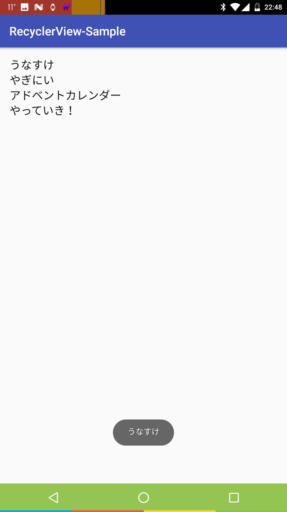
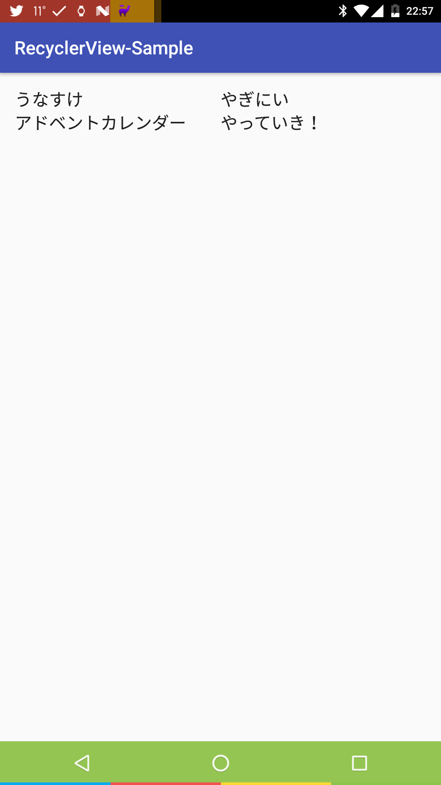

# RecyclerView-Sample
これは[やぎすけ Advent Calnder2016](http://www.adventar.org/calendars/1800)2日目「[さくっとRecyclerViewを使ってリストを作成する](https://blog.yagi2.com/2016/12/03/how-to-use-recyclerview.html)」のサンプルコードです。  
最小限のコードのみ、記載しています。  
詳しくは[さくっとRecyclerViewを使ってリストを作成する]()を御覧ください。  

## Screenshots
  
* ListView

  
* GridView

 